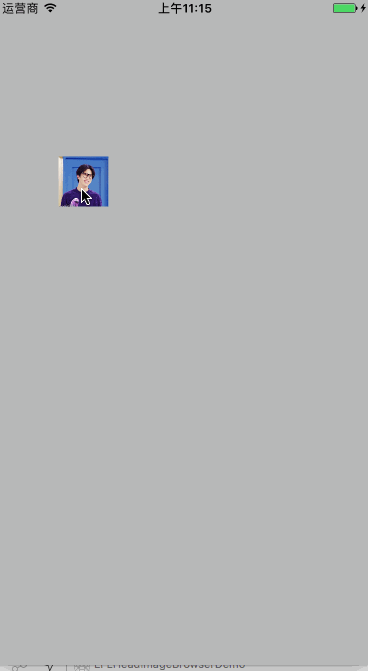
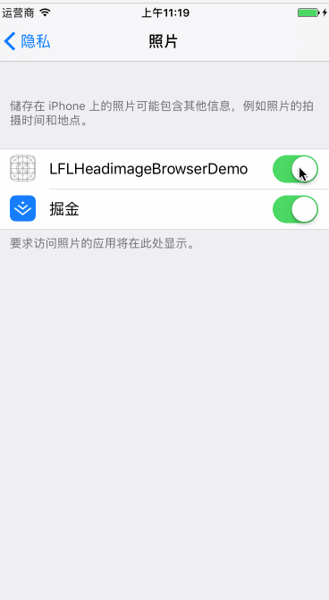

## content List 

### AdapteriOS11 and iPhoneX

- [**iOS-adapter-iPhoneX**](./AdapteriOS11/iOS-adapter-iPhoneX.md)

- [**AdapteriOS11**](./AdapteriOS11/readme.md)

### LFLRandomCodeView 绘制图片随机验证码

###  高仿对于keep有点亮效果图标 + 文本箭头提示,只显示一次逻辑已处理 
	`也可以可以一行代码实现新手引导界面常见文本提示(带箭头)`
    

###  头像点击查看大图和保存功能实现

- [Swift Version](https://github.com/DevDragonLi/SwiftCodeRepo/tree/master/LFLHeadimageBrowserDemo)

### 一个利用OCMock+GHU进行单元测试的Demo

Requirements
==============

library requires `iOS 6.0+` and `Xcode 6.0+`.

# 3. 有任何问题，请及时 issues me 
 <dragonli_52171@163.com>   
