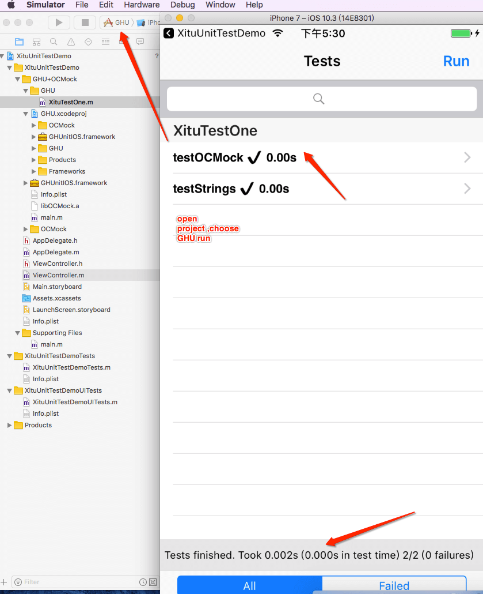

# this repo record iOS dev Demo code ...

 
 

## Stargazers over time

*  详细细节还需要看各个demo文件夹说明, readme可能有些写得不详细,部分`code Demo` 参考此文件最下方的展示示意图`example_GIF`

* **recommend clone **

> `git clone --depth 3 https://github.com/DevDragonLi/iOSDevDemo`

## root demo list (doing)

- [GCD_Demo](GCD_Demo)
- [KVO_Demo](KVO_Demo)
- [InterviewExampleCode](InterviewExampleCode)
- [Apple_APIDemo](Apple_APIDemo)

##  content list  

-  **DevDemo**  
	- [一个利用OCMock+GHU进行单元测试的Demo](./1-DevDemo/XituUnitTestDemo)
	- [sharedInstanceDemo&&destroy](./1-DevDemo/sharedInstanceDemo)
	- [一个简单私有化pod的demo](./1-DevDemo/PodPrivate_demo)
		- [参考流程文稿](https://github.com/DevDragonLi/Dev-Repo/tree/master/Pods)
	- [ReactiveObjCDemo-早期code](./1-DevDemo/ReactiveObjCDemo)`后期代码迁移补充`
	- [列表预加载处理方案](./1-DevDemo/preloadListData)
	- [CodeSnippets && FaceID&&TouchID](./1-DevDemo)

- **UIDemos**(侧重`UI`效果实现的一些Demo)
	- **沸点多图选择器(带内置拍照)demo**[XTPhotoPicker](./3-UIDemos/XTPhotoPicker/readme.md)
	- [LFLRandomCodeView绘制图片随机验证码](./3-UIDemos/LFLRandomCodeView)
	- [高仿对于keep有点亮效果实现(文本各方向箭头tips)](./3-UIDemos/KeepGuide)
	- [简单封装拍照相册选取工具&&相关涉及代码](/3-UIDemos/CameraAndPhotoAlbumDemo/readme.md)
	- 头像点击查看大图和保存功能demo
		- [OC](./3-UIDemos/LFLHeadimageBrowserDemo)
		- [Swift](https://github.com/DevDragonLi/SwiftCodeRepo/tree/master/LFLHeadimageBrowserDemo)
	- [TableViewCell依次插入动画](./3-UIDemos/TableViewCell依次插入动画)

- **AdapteriOS11 and iPhoneX** 
	- [**iOS-adapter-iPhoneX**](./2-AdapteriOS11/iOS-adapter-iPhoneX.md)
	- [**掘金客户端AdapteriOS11**](./2-AdapteriOS11/readme.md)

- **项目涉及GIF有关处理,性能优化demo**
	- [对于旧项目,采用 sdwebimage 4.0以下版本,可以参考 demo](./4-GIFDemos/GIF-Optimize) 
	- [相册选取 GIF处理,展示,解决浏览和优化内存占用问题](./4-GIFDemos/handle_Album_Select_GIF_Demo)

	- [InterviewExampleCode](./iOS/InterviewExampleCode)

##   Example_GIF 

- 
- 
- 
- 

Requirements
==============

library requires `iOS 6.0+` and `Xcode 6.0+`.

# 3. 有任何问题，请及时 issues me`dragonli_52171@163.com`   
